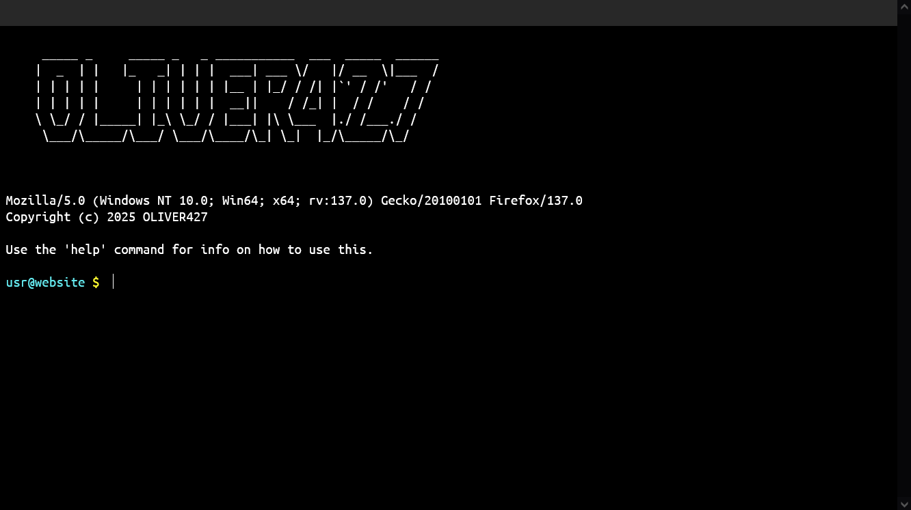

# Terminal Website Thingie

I did this mostly for fun, but it was also an assignment for school.
I sure hope you know how to use a terminal. Even if you can't, you should be able to use this since its not the closest thing to a terminal ever.

# Real reason I did this

Well as I just said, I mostly did it for fun. Making it into an assignment I had to do was just another thing that I used as an excuse to work on a new project. I really like making new things, but I can almost never think of any (but to clarify, I was not assigned to make a terminal website, that was my idea.)

# The technicalities

So... this website was supposed to be a portfolio. Yeah, I know, It doesn't really feel like a portfolio. I just really wanted to make something so this ended up being used for that. You could probably maybe technically possibly count this as a portfolio as it does show a bunch of my projects, but also you could just check my github account if you wanted to do that.

# The browser
This runs most optimally on Firefox for some reason. It does run on chrome but I would recommend firefox since the font gets really blurry on chrome.

